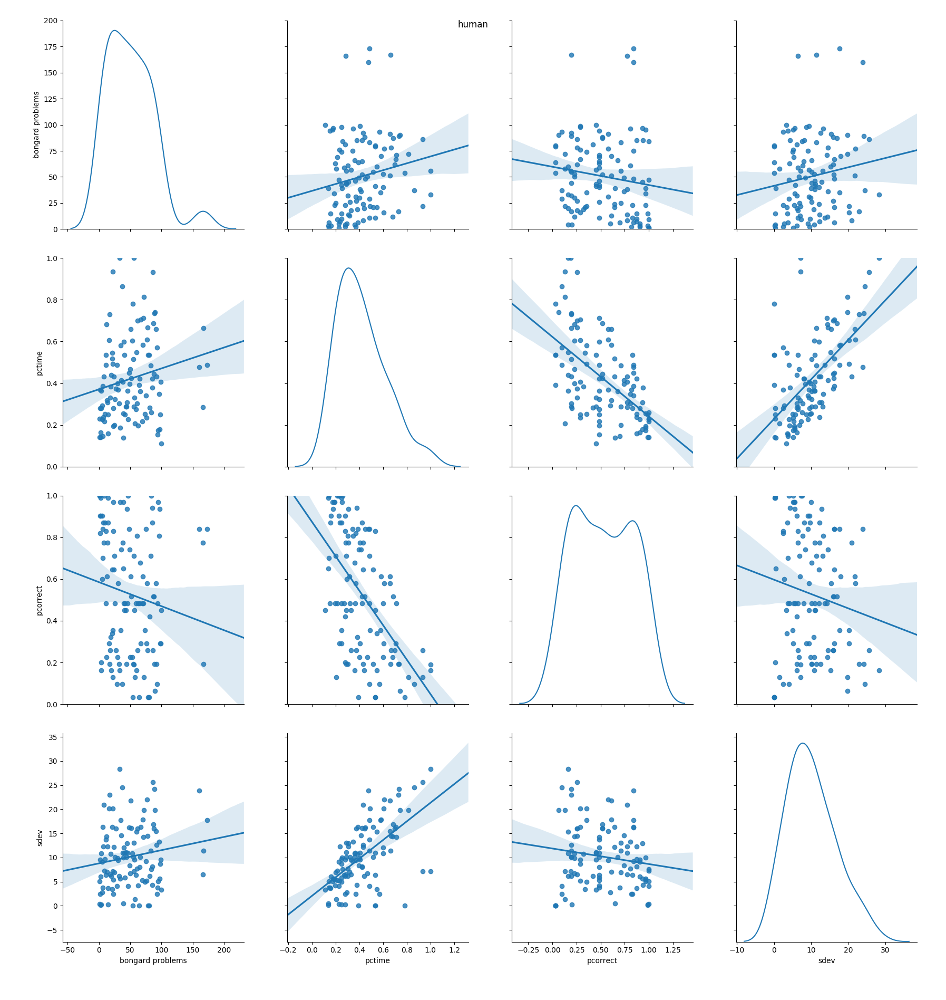
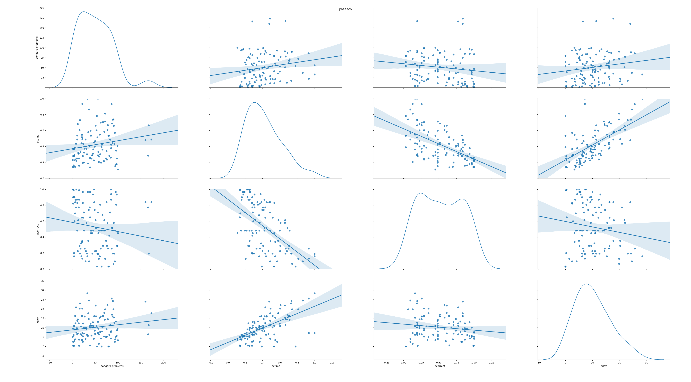

# Phaeaco performance analysis

These scripts analyze data from the Phaeaco dissertation. They show, for example, correlations between percentage of time taken to solve each problem and the percentage of correct answers per subject group.

Human data:

Phaeaco data:

Both (Wide linear fits can be ignored):

